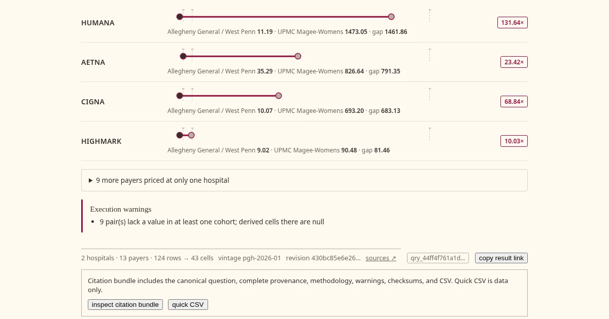

This tool (pght) compares what Pittsburgh hospitals charge for the same procedure. 
It reads the standard-charge files US hospitals publish under federal law, starting with five Pittsburgh files, 4.5 million rows, from January and March 2026. 

That data has been known hostile territory for years. 
Prices filed for services a hospital does not provide made the literature as ["ghost codes"](https://pmc.ncbi.nlm.nih.gov/articles/PMC11363865/). 
The Peterson-KFF Health System Tracker keeps a [running catalog](https://www.healthsystemtracker.org/brief/ongoing-challenges-with-hospital-price-transparency/) of the ways these files confound anyone who opens them: 
 - percent-of-charge values sitting in dollar columns
 - placeholder rates CMS has since had to ban outright
 - one procedure described 490 different ways
 
Schema parsers are free and plentiful but there is still a need to reconcile what is inside. 

Here is what building that layer over one metro actually required, and the four traps it survived.

**Invented numbers.** Postgres offers two medians. The continuous one, over an even number of values, averages the two middle rows. That average is nobody's rate. It appears in no contract, on no bill, and it renders beautifully. A dashboard full of interpolated medians looks identical to a dashboard full of real prices. This is not rare. The first time a check ran against my generated findings, twelve of twenty stated a dollar figure the data could never return. 
The findings corpus computes only the discrete median, which is always a rate somebody actually filed; the interactive grammar offers both medians deliberately, because the middle of a distribution is a fair question and the continuous median is its honest answer. Every published figure re-executes against the live database before it counts. The corpus is also audited against the field's documented artifacts: no placeholder rates, no non-positive prices, and the sub-dollar and seven-figure rates that do exist are examined, documented in docs/data-quality.md, and kept out of the analytical surface by a tested sweep floor.

**Mislabeled rows.** One payer is not one payer in this data. An insurer's rates turn up filed under its parent company. Another files a Medicaid product under a subsidiary's old name, from before the acquisition. A third arrives as, on paper, just "Medicare." Every one of these is a legal, real filing pattern, and every row passes a schema check. Nothing in the files tells you anything is wrong. But each misfiled identity quietly moves tens of thousands of rows to the wrong side of a comparison, and you cannot pair rates across hospitals until the identities are true. Correcting them moved 145,004 rows. The market agrees on the difficulty: one vendor's engineering blog describes reconciling [roughly 170,000 raw payer and plan name strings into 553 canonical plans](https://www.serifhealth.com/blog/payer-name-matching-price-transparency), and their answer, like every vendor's, is proprietary. There is no version of this you can skim your way to. You have to know the payers, or you have to go looking.

**Corrections that manufacture the bug.** Sometimes the right correction is to not correct. One product looked just like the mislabeled cases above, same payer, two names. Splitting it was the obvious move, and it would have guaranteed that two hospitals never compare at all, because the second hospital files that product under a plan name rather than a payer name. This one stays together with a comment saying why. Every repair layered-in has to be checked against the antecedent repairs. An apparent fix in isolation is often just the next bug.

**Invalid comparisons.** This tool compares hospitals per payer, and the checks were passing: the prose matched the engine, the engine matched the rows. The comparison was still wrong because the two sides were different insurance products. Aetna sells a commercial plan and a children's Medicaid plan, and both were in the pairing as though they were one thing. The difference is not a labeling nuance: the same insurer's commercial rates run [about twice its Medicare Advantage rates](https://doi.org/10.1377/hlthaff.2023.00039) at the same hospital for the same service, so mixing the classes averages a real twofold difference. No correctness check can see that, because correctness is not the property being violated. Comparability is. Every comparison in the tool is now confined to a single product line, and the loader refuses to publish one that could cross.

One number carried all four of these. The knee MRI at UPMC Magee, $2,848.00, was the headline figure of the tool from the first version until the corrections finished. It was a real, filed rate the whole time. It was also published under the wrong payer, paired against a rate from a different product line, and surrounded by headline figures that existed in no file. Every correction landed: the attribution is now Cigna commercial, the pairing is like-for-like, and the figure itself never changed. You will not find it on the page today. Once the math was finally honest, its median pair, $2,848.00 against $246.49, turned out identical to another procedure's, and the corpus keeps one story per pair of amounts. The top slot now belongs to a $693.20 lab panel that outscored it. The machinery has no favorites.

None of these problems is visible in the software, and that is the point. You cannot tell from the outside whether a number was checked once or checked until it held. The only evidence is the list of things that are not wrong with it, and that is why I am writing about them here. This is what is involved in producing a list worth using. 

Like so many, the last chapter of my career ended and I have been trying to find the next. 
This tool is meant to demonstrate domain competence in healthcare data alongside disciplined, AI-augmented software development.

It runs at [prices.georgelarson.me](https://prices.georgelarson.me), and every figure on it re-executes from its own stored query, so you do not have to take any of this on my word.

<!-- social:linkedin -->
US hospitals have to publish their prices. What they publish is a minefield: prices filed for services a hospital doesn't provide, placeholder rates CMS had to ban, one procedure described 490 different ways. The schema parsers are free. Nobody publishes the layer that reconciles what's inside.

I built that layer for one metro: five Pittsburgh hospital files, 4.5 million rows, and a tool that compares what hospitals charge for the same procedure. Every published figure re-executes from its own stored query against the live data before it counts.

Building it meant surviving four traps:

Invented numbers. Postgres's default median averages the two middle rows — a rate that appears in no contract and on no bill. The first time a re-execution check ran against my generated findings, twelve of twenty stated a dollar figure the data could never return.

Mislabeled rows. One payer is not one payer in this data. Subsidiaries file under parents, acquired products file under old names. Correcting the identities moved 145,004 rows.

Corrections that manufacture the bug. Sometimes the right correction is to not correct. One "duplicate" payer, split, would have guaranteed two hospitals never compare at all. Every repair has to be checked against the repairs before it.

Invalid comparisons. A commercial rate and a children's Medicaid rate from the same insurer are prices of different products — about a twofold difference at the same hospital. Every comparison in the tool is now confined to one product line, and the loader refuses to publish one that could cross.

None of this is visible in the software. The only evidence is the list of things that are not wrong with it.

Tool: https://prices.georgelarson.me
Full writeup: https://georgelarson.me/writing/2026-07-26-pght/

#Healthcare #DataEngineering #Go #DataQuality #PriceTransparency
<!-- /social:linkedin -->

<!-- social:mastodon -->
US hospitals must publish their prices. Inside: ghost codes, placeholder rates, one procedure described 490 ways. Parsers are free; nobody reconciles the payers.

I built that layer for Pittsburgh — 4.5M rows, five files. Every figure re-executes from its own stored query.

Four traps: interpolated medians (12 of 20 findings failed), 145,004 mislabeled rows, corrections that manufacture the next bug, comparisons no correctness check can see.

https://georgelarson.me/writing/2026-07-26-pght/
<!-- /social:mastodon -->
