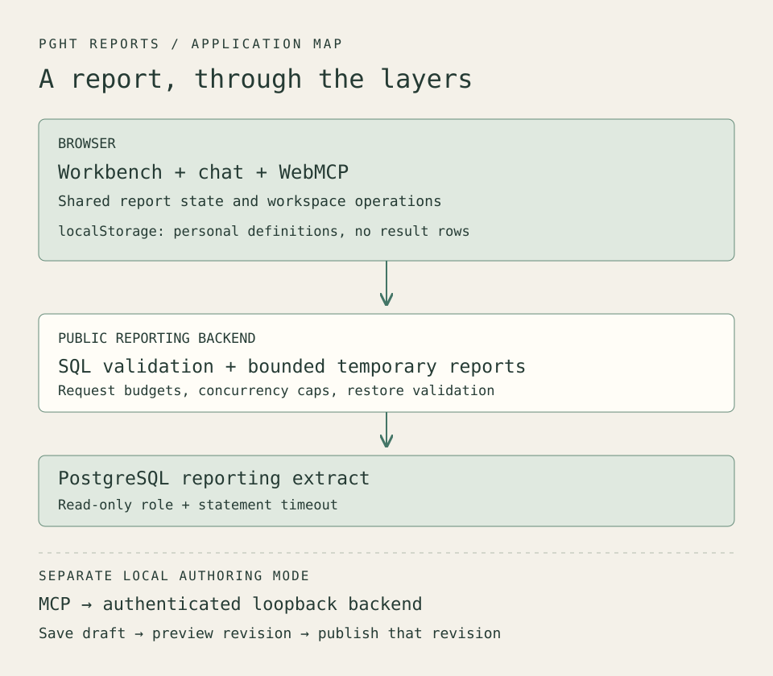

I wanted to be able to ask a question about hospital prices, keep the useful result, and let an agent work with that same report later. That sounds like a small addition to a dashboard. It reaches into nearly every part of the application: query execution, saved state, navigation, publication, and what an agent can safely infer from the screen.

[PGHT Reports](/pght-reports.html) is my working version of that idea. It combines a reporting workbench, conversational queries, personal report definitions, and tools for agents. The interesting parts are the boundaries between them.

[Open the diagram at full size](cover.svg).

## Start with what a row means

The broader PGHT project ingests Pittsburgh hospitals' published standard-charge files and builds source-aware queries over them. I wrote about the reconciliation work in [Four traps in hospital price data](/writing/2026-07-26-pght/).

The reporting application uses a separate extract: 22,428 observations across five hospitals in the demonstration dataset. That count describes rows in this extract. It does not count patients or establish how many distinct contracts exist, and it does not describe the size of the full PGHT corpus.

This distinction matters when chat makes querying easy. A query can execute correctly while comparing incompatible settings or billing classes. The reporting layer provides ways to inspect results; the source choices and the meaning of a comparison still need attention.

## Follow the question through the backend

A question in chat goes to the reporting backend's AI route. Proposed SQL passes through the query guard before execution. Builder-generated queries and restored report definitions also encounter validation on their respective paths.

The guard parses SQL and examines its structure. It rejects multiple statements, write operations, data-modifying CTEs, and SELECT INTO. It restricts tables, schemas, columns, and functions, and applies a result-limit policy. An allowed function list prevents an apparently ordinary SELECT from reaching arbitrary database functions.

The database connection supplies another boundary. The demo uses a read-only database role, and connections carry a statement timeout. The role's privileges are deployment configuration, so choosing the correct database account is part of setting up the application. Query validation and database permissions both have work to do.

Public mode also bounds request size, request rate, concurrency, and the number of temporary reports. Excess concurrent requests receive a rejection rather than accumulating in an unbounded queue. A fluent model response never grants permission to bypass these checks.

## Let visitors keep their work

A read-only demo can feel unfinished when every useful experiment disappears. I wanted visitors to change a report and return to it without giving strangers a shared write surface or adding accounts to a portfolio project.

The compromise is **My Reports**. Copying a report saves its definition in localStorage: its name, query or builder state, and presentation settings. Result rows are fetched again when the report opens. The browser retains the recipe without promising that yesterday's result remains current.

On reopen, the backend validates the definition and executes the query before registering a fresh temporary report. Builder-origin definitions are recompiled from their builder state. SQL-origin definitions pass through the SQL guard. An expired temporary ID or backend restart therefore does not require the visitor to reconstruct the saved report.

Storage has explicit limits: 25 reports, with size bounds on each definition and its SQL. Invalid stored data blocks further saves until reset, so a damaged workspace is not silently overwritten. Persistence belongs to this browser profile and origin; clearing browser data removes it, and another device does not receive a copy.

Those limits make the feature useful without creating an account-sync service to operate. Visitors can experiment with personal copies while the shared examples remain protected.

## Give agents the page's own operations

[WebMCP's imperative API](https://github.com/webmachinelearning/webmcp/blob/main/README.md) lets a page register tools through document.modelContext. PGHT Reports uses that surface to expose operations on the running application.

The nine tools cover listing and opening shared reports, reading report context and data, and listing, opening, copying, updating, and deleting personal reports. They call the same workspace operations used by the interface. A browser agent opening a report changes the report the person sees.

Data access needs more care than returning whichever rows happen to be in memory. Opening another report clears the previous snapshot. A data request during loading or after a query error receives that state instead of stale rows dressed up as a successful answer.

Responses are bounded to 50 rows, 50 columns, and 512 characters per cell, with truncation flags. Context distinguishes requested filters from evidence that a particular query applied them. An agent gets enough information to inspect the current report, along with reasons it may need to ask for more.

The page detects browser support before registering tools. Its ordinary reporting and chat interface remains usable when WebMCP is unavailable. This makes the browser integration an additional way to operate the application, with the existing UI available for inspection.

## Keep authoring separate

The local authoring workflow has a different purpose and different authority. Its MCP server uses the [stdio transport](https://modelcontextprotocol.io/specification/2025-06-18/basic/transports): an MCP client runs it as a local subprocess. The adapter calls a loopback authoring backend with a configured bearer token. It does not need database credentials or make its own model calls.

Its six tools support schema discovery, report discovery and inspection, saving a draft, previewing it, and publishing it. Publication requires a successful preview of the same draft revision, including query execution and chart-shape validation. Editing the draft means previewing again. Replacing an existing publication also checks its expected revision.

That gate establishes what was tested. It does not establish human approval; callers must supply any approval workflow they require. The backend refuses to start with public and authoring modes enabled together.

There are three agent interfaces across the projects: PGHT's underlying query MCP, the reporting application's local authoring MCP, and its browser WebMCP tools. The reporting extract has its own backend. A browser tool call does not travel through all three interfaces or acquire the local author's publication privileges.

## Keep the conversation attached to the report

On desktop, chat occupies a resizable pane beside the workbench. On a phone, Report and Chat become views of the same workspace. Switching between them preserves the conversation and draft input.

This affected asynchronous behavior too. A preview may finish after someone changes views or opens another report. The application preserves work across the paired Report/Chat views, while navigation to a different context invalidates old results. Otherwise an earlier request could update the wrong report or interrupt a later conversation.

Verification included the frontend and backend suites, then direct browser checks of native tool calls, saved-report behavior, resizing, and phone navigation. Browser inspection caught a layout problem that passing component tests had not exposed. A real chat query returning the extract's row count also exercised the connection between the visible interface and backend data.

The next thing I want to learn is how people use these operations together: which reports they keep, what they ask an agent to inspect, and where they return to the visual interface. The [project walkthrough](/pght-reports.html) collects the demo and its controls for trying that workflow.
